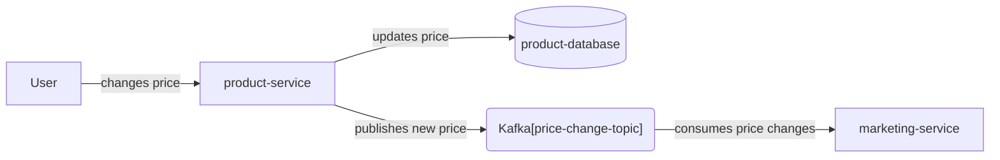
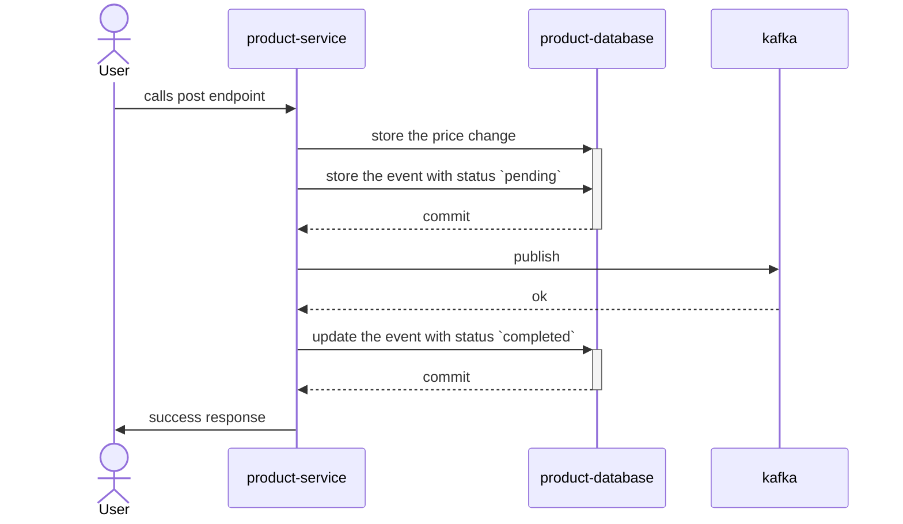

# Outbox Pattern

## Problem

Let's picture a common scenario where we have a service that manages `Products` and our customer wants to change a property of a given product, let's say its `price`. Several other systems might be interested in the price change information, for instance the *marketing* team could have some triggers configured to send e-mails to certain customers about offers. 

To solve that we can use `Kafka` as event buss, so when the price is updated by the *product-service*, it can publish a new event to a kafka topic and then the *marketing-service* can consume it and have the new value for the price of that product.

Ok, but the **product-database** and **price-change-topic** are different external systems from the **product-service**, they are separated by a *network* connection and we have one state that we need to propagate to them and in most of the cases we want to ensure that they agree to with each other, even if not immediately. 

``Writing to both using database transaction`` is the first thought that might come to mind, but that can be misleading, because, in a  situation where the transaction is rolled back after the communication with Kafka is flushed, you would end up with a *ghost* event on the topic. Depending on the publishers configuration it could also happen that the event would stay on the buffer to be send even after the transaction is committed, and in a case of an interruption on the system those events would be lost. 

How can we ensure that the state between the two storage systems is consistent? Meaning, when I have the price stored in the database I'll have it on the topic as well.

### Outbox Pattern

The Outbox Pattern is a trick where we use the database transaction to ensure no events are lost. 
You can simply implement it by adding a second transaction and storing the event to the database with a `pending` state and once it is published you update it to `published`. In the case of something goes wrong events can be retried, and the worst inconsistency that can happen is having duplicated events on the topic. Let's see all the scenarios bellow.

#### Happy Path

---

#### Failure to publish to kafka 
