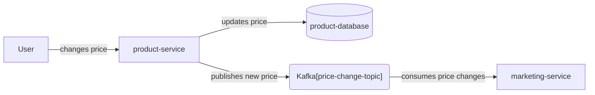
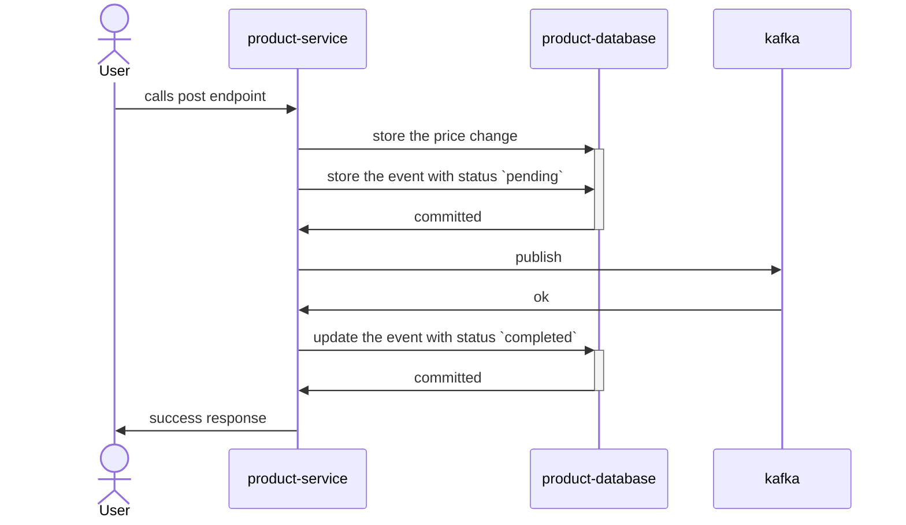
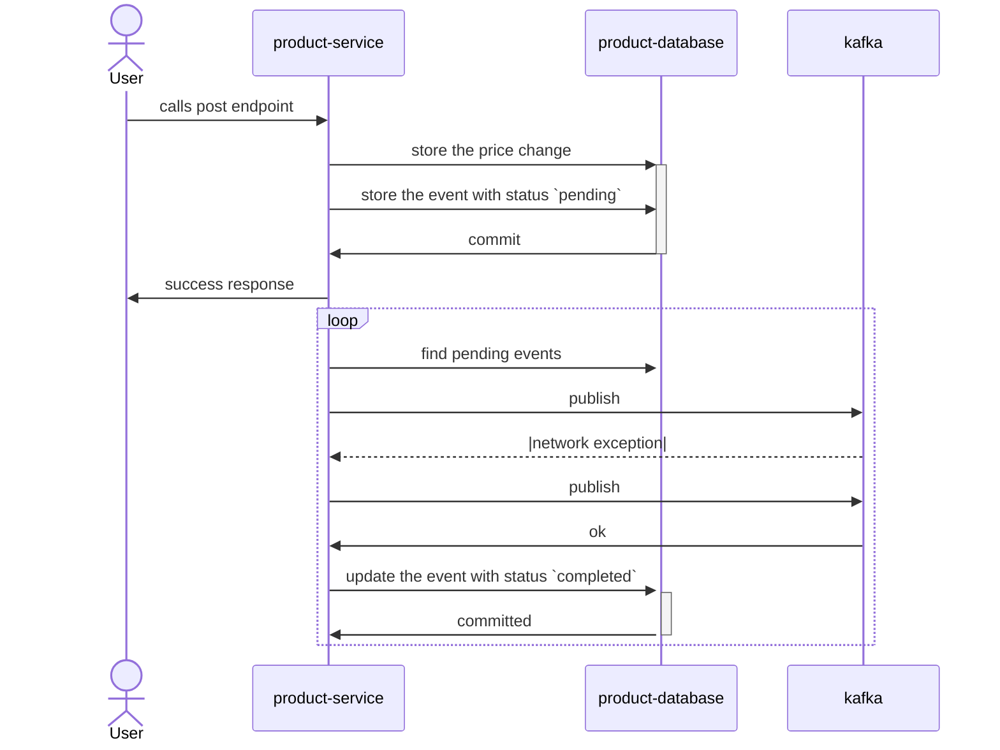
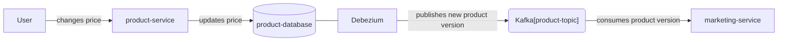
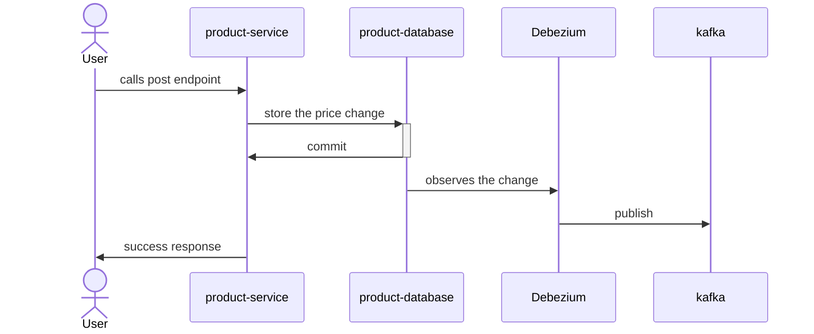
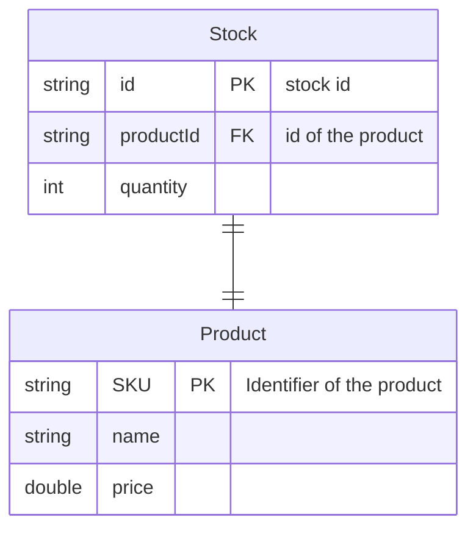
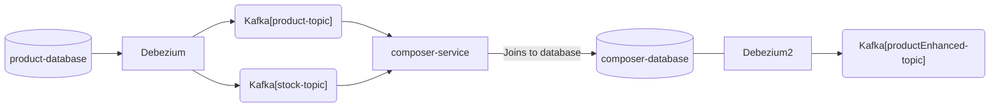
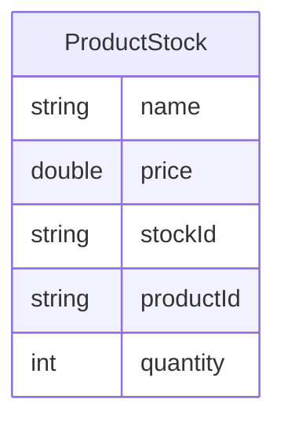

## Problem

Let's picture a common scenario where we have a service that manages `Products` and our customer wants to change a property of a given product, let's say its `price`. Several other systems might be interested in the price change information, for instance, the **marketing** team could have some triggers configured to send e-mails to certain customers about offers.

To solve that we can use `Kafka` as an event bus, so when the price is updated by the *product-service*, it can publish a new event to a Kafka topic, and then the *marketing-service* can consume it and have the new value for the price of that product.

Ok, but the **product-database** and **price-change-topic** are different external systems from the **product-service**, they are separated by a *network* connection and we have one state that we need to propagate to them and in most cases, we want to ensure that they agree with each other, even if not immediately.

``Writing to both using database transactions`` is the first thought that might come to mind, but that can be misleading. There is no shared transaction boundary between the database and Kafka topic but rather there are two. Our product service would need to synchronize between these two systems and perform some form of two-phase commit to keep systems in sync. Let's see scenarios that can happen:

|  | database ✅ | database ❌ |
| --- | --- | --- |
|**Kafka ✅**| happy path | send rollback event |
|**Kafka ❌**| rollback in DB | noop |

 In a  situation where the transaction is rolled back after the communication with Kafka is flushed, you would end up with a *ghost* event on the topic that would need to be handled by sending a rollback event. Depending on the publisher's configuration it could also happen that the event would stay on the buffer to be sent even after the transaction is committed, and in a case of an interruption in the system, those events would be lost.

The problem is in the delivery guarantees of the data. A couple of options can happen:

* At most once delivery - best effort but no guarantees for durability. In edge cases, some data may be lost. This is a common pattern for storing logs.
* Exactly once delivery - the data is not duplicated and the producer guarantees full synchronization between Kafka and database. This is very hard to achieve.
* At least once delivery - the data may be duplicated but the producer guarantees delivery at least once. Usually, events are not duplicated but during edge case scenarios it can happen (f.e. network partition). This is the usual compromise to go, and consumers of data need to compensate. Then consumers apply a deduplication window based on their use case.

How can we ensure that the state between the two storage systems is consistent? Meaning, when I have the price stored in the database I'll have it on the topic as well.

## Implementing the Outbox Pattern

The Outbox Pattern is a trick where we use the database transaction to ensure no events are lost guaranteeing at least once delivery.
You can simply implement it by adding a second transaction. First, by storing the event in the database with a `pending` state, and once it is published to the topic, you update it to `published`. In the case of something going wrong events can be retried, and the worst inconsistency that can happen is having duplicated events on the topic. Let's see all the scenarios below.

## Happy Path

---

## Failure to publish to Kafka

When there is a failure to publish to Kafka, the service can retry from the database and make sure that no messages are lost. Furthermore, if you want to ensure that the order of the events is preserved, you can go for publishing the events always through a secondary process that would select from the database and publish them to Kafka.

The downside of this approach is the eventual increase in the SLA of the delivery of the event. That's the trade-off to gain eventual consistency.

> If you have multiple nodes of the product-service, you still need to take care of the order of the events.
{: .prompt-tip }

* One solution is to use a leader election and publish on a single node, using the Single Producer Principle. Although if you are in a high throughput that can be a bit problematic and slow your business down.
* Another solution is to attribute a specific partition or group of partitions to a specific node that you can select from the database using the partition key and that would still keep the order across the multiple nodes. The downside is a bit of configuration and you would still lock your nodes to the size of partitions and that would make scaling harder.

---

## Change Data Capture

Change Data Capture connects directly to your database, reading its log files, infers the changes from the logs, and publishes the events to Kafka directly. If any error occurs on the publish, it can take care of the retry for you, and it is all transparent.
One popular implementation of the CDC is the [Debezium](https://debezium.io/) project.

---

### Outbox Table Pattern

Now let's put it all together!

CDC is great for `Event Sourcing` when we publish the state of the event every time, which is great to replicate data across systems, like in the case where we wanted to propagate the price. But what if we have a use case of `Event Streaming` where we want to expose a fact that happened, for instance, `product-sold-event`. In this scenario, we would not have exactly an entity that we want to propagate but a new event that we want to publish. Still, that can follow the same pattern as the CDC. You just need to create a table that would match your new event and store them there instead of publishing them directly. Eventually, you would need to clean up this table to not let it grow forever.

This approach can be very powerful, because it can also allow you to de-normalize data from different sources and then provide it as events downstream, giving this data a new purpose.  
Let's consider this simple example below: (ignore the super simple and nonrealistic modeling)

Depending on your domain, you might have multiple bounded contexts that would benefit from having an event that would already group both entities, `Product` end `Stock`. So, from the `product-service` domain can receive two distinct events from each of the entities, then we can join them and further use the CDC to publish it downstream.
Also to note that I'm picturing here `Product` end `Stock` as two entities in my database, but they could also be events from different systems.

## NoSql no problem

Oh, you are not using a SQL database and still want to benefit from this pattern? [Confluent](https://www.confluent.io/) provides a long list of connectors that allows you to connect your storage to Kafka, making easy data replication. The list goes from `Elasticsearch`, `Kinesis`, and `MongoDb` to many more.

## Summary

Data replication across the organization and sometimes even beyond the organization is a challenge and an opportunity that we face every day. By using these simple tricks we can achieve the right consistency without trading off the latency too much. Of course, if absolute latency is your concern, and you are on the *p999 < 100 milliseconds* SLAs maybe you should consider other communication patterns.
